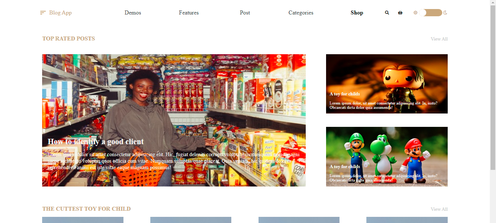
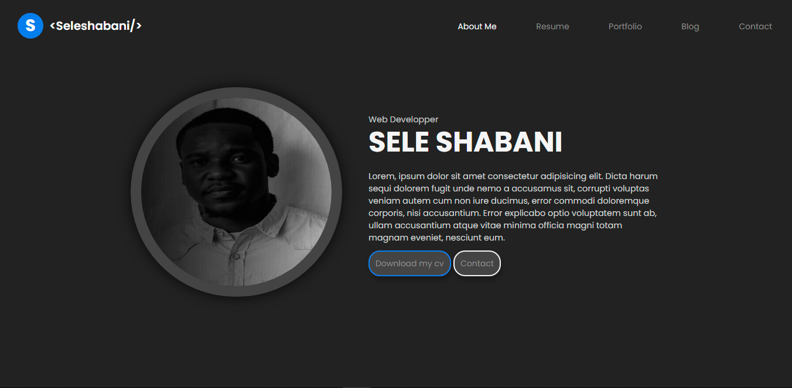

# Templates
touts mes templates HTML, CSS et Javascript.
la plupart des ces templates étaient à l'origine des shots <a href="https://dribbble.com/">dribbble<a>, je me suis donnée comme petit défi personnel de les transformer en page web. 
merci à ces designers talentueux pour leurs travails
***
#Listes des projets 
- E-commerce 1  
  
- E-commerce 2  
  
- Social Media  
  
- Music App  
  
- Music App 2  
  
- Blog  
  
- dark portfolio  
  
  
